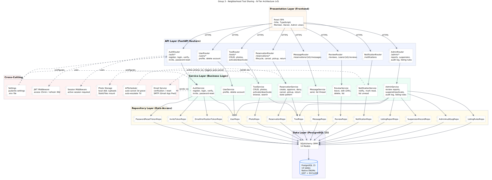
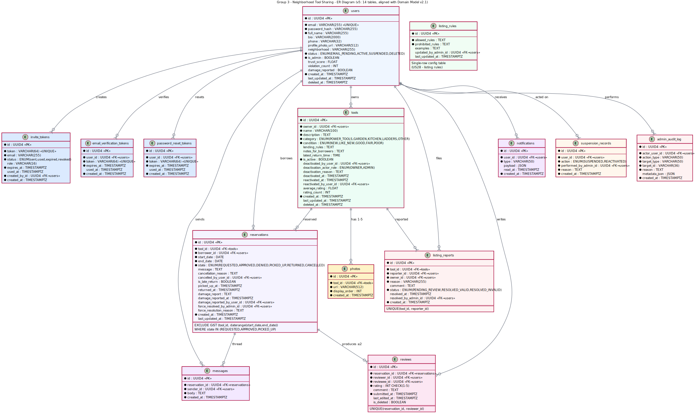
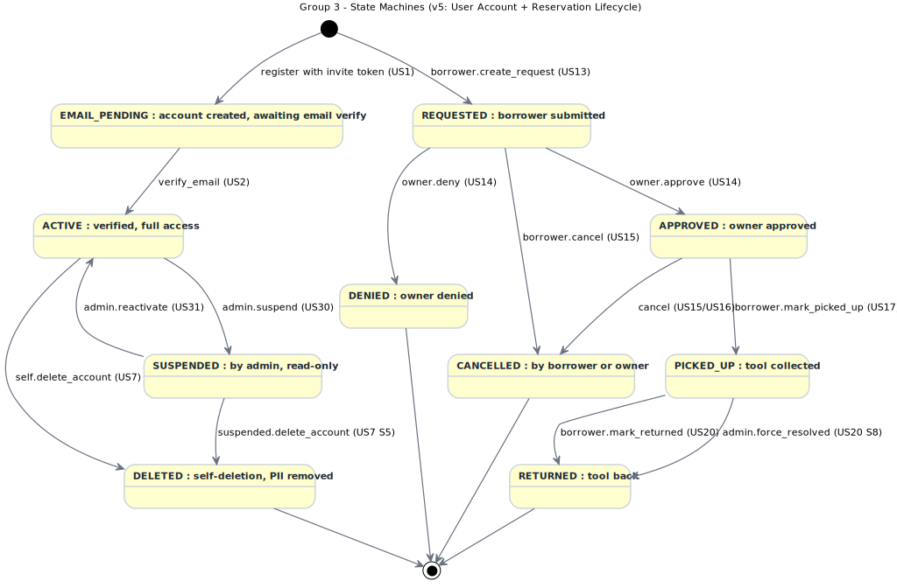

# Technical Design Document — Backend

**Project:** ICS 613 — Neighborhood Tool Sharing Platform
**Team:** Group 3
**Date:** June 20, 2026
**Scope:** Backend only (FastAPI + PostgreSQL)
**Source:** Real codebase under `/backend/` — all details reflect the actual implementation

---

## 1. Architecture Diagram + Components

### N-Tier Architecture

The backend follows a strict **N-Tier** pattern with four layers plus cross-cutting concerns (see diagram above).

### Component Inventory

| Component | File | Responsibility |
|-----------|------|----------------|
| **Application Factory** | `app/main.py` | FastAPI app creation, CORS, exception handlers, static file mount, scheduler startup |
| **Config** | `app/config.py` | pydantic-settings from `.env`: DB URL, JWT secret, token TTLs, CORS origins, upload dir |
| **Security** | `app/core/security.py` | bcrypt password hashing (12 rounds), JWT mint/verify (HS256), access+refresh token pair |
| **Exceptions** | `app/core/exceptions.py` | `AppError` base class, `VerifyTokenError` with `resend_available` flag |
| **DB Session** | `app/db/session.py` | SQLAlchemy engine, `SessionLocal` factory, `get_db()` FastAPI dependency |
| **DB Base** | `app/db/base.py` | SQLAlchemy `declarative_base()` |
| **API v1 Router** | `app/api/v1/__init__.py` | Aggregates 9 feature routers under `/api/v1` |
| **Auth Router** | `app/api/v1/auth.py` | 12 endpoints: register, verify-email, resend, login, refresh, logout, /me CRUD, forgot/reset-password, invites |
| **Tools Router** | `app/api/v1/tools.py` | 11 endpoints: CRUD, photo upload/delete, deactivate/reactivate, availability filter |
| **Reservations Router** | `app/api/v1/reservations.py` | 10 endpoints: full lifecycle (create, list, approve, deny, cancel, pickup, return, damage, force-return) |
| **Messages Router** | `app/api/v1/messages.py` | Reservation thread messaging |
| **Notifications Router** | `app/api/v1/notifications.py` | Notification list and mark-read |
| **Reviews Router** | `app/api/v1/reviews.py` | 4 endpoints: create per-reservation, list, edit (24h), delete (24h) |
| **Admin Router** | `app/api/v1/admin.py` | User deactivate/reactivate/delete, tool deactivate/reactivate, audit-log, reports |
| **Health Router** | `app/api/v1/health.py` | `GET /api/v1/health` |
| **AuthService** | `app/services/auth.py` | Registration with invite, email verification, login, token refresh, logout, forgot/reset-password, invite creation, profile update, account deletion |
| **ToolService** | `app/services/tool.py` | Tool CRUD, photo upload (1-5 limit, 5MB, image-only), deactivation/reactivation with audit, availability date-range filter |
| **ReservationService** | `app/services/reservation.py` | State machine enforcement, overlap rejection (409), concurrent-safety via DB EXCLUDE, cancel, pickup, return, damage-report, admin force-return |
| **UserService** | `app/services/user.py` | Profile CRUD |
| **ReviewService** | `app/services/review.py` | Review create/update/delete, rating recalculation on trust_score, 30-day window, 24h edit window |
| **NotificationService** | `app/services/notification.py` | Create on status changes, list, mark-read |
| **AdminService** | `app/services/admin.py` | User deactivate/suspend/reactivate, tool deactivate/reactivate, audit-log queries, reports |
| **Scheduler** | `app/services/scheduler.py` | APScheduler: auto-cancel overdue pickups (3-day grace), auto-escalate overdue returns (7-day), HST-aware |
| **PhotoStorage** | `app/services/photo_storage.py` | Local disk storage under `backend/uploads/`, served via FastAPI `StaticFiles` mount at `/uploads` |
| **User Model** | `app/models/user.py` | 22 columns, UUID PK, PostgreSQL ENUM for status (EMAIL_PENDING/ACTIVE/SUSPENDED/DELETED), trust_score, damage_reported, violation_count |
| **InviteToken Model** | `app/models/invite.py` | UUID PK, UNIQUE(token), status ENUM(sent/used/expired/revoked), FK→users, expires_at. Token auto-emailed per v5 Admin Invites story. |
| **EmailVerificationToken Model** | `app/models/email_verification.py` | UUID PK, UNIQUE(token), FK→users CASCADE, expires_at + used_at |
| **PasswordResetToken Model** | `app/models/password_reset.py` | UUID PK, UNIQUE(token), FK→users CASCADE, expires_at + used_at |
| **Tool Model** | `app/models/tool.py` | UUID PK, FK→users, 5-category ENUM, 5-condition ENUM, is_active, deactivation/reactivation audit, deleted_at for soft-delete, rating aggregates |
| **Photo Model** | `app/models/photo.py` | URL + display_order, CASCADE from tools |
| **Reservation Model** | `app/models/reservation.py` | UUID PK, FK→tools+users, 6-state ENUM(REQUESTED→APPROVED→PICKED_UP→RETURNED + DENIED/CANCELLED), EXCLUDE GiST, damage report, admin force-resolution, cancellation audit |
| **Message Model** | `app/models/message.py` | UUID PK, FK→reservations, FK→users(sender_id), body TEXT (5000 char max), created_at index. Threads open only in REQUESTED/APPROVED/PICKED_UP per US22. |
| **Notification Model** | `app/models/notification.py` | UUID PK, FK→users, type ENUM (10 event types), payload JSON with reservation/tool data, read_at timestamp. In-app only per course project scope. |
| **Review Model** | `app/models/review.py` | UNIQUE(reservation_id, reviewer_id), 24h edit tracking |
| **ListingReport Model** | `app/models/listing_report.py` | UNIQUE(tool_id, reporter_id), 3-state ENUM |
| **SuspensionRecord Model** | `app/models/suspension_record.py` | Historical audit trail per member, 2-action ENUM |
| **AdminAuditLog Model** | `app/models/admin_audit_log.py` | UUID PK, FK→users(actor), action_type, target_type+id, reason (required), metadata JSON. Immutable — never updated, only inserted. |
| **ListingRules Model** | `app/models/listing_rules.py` | Single-row config. ICEBOX per v5 phasing (US28 simplified to category dropdown; this model may not be implemented). |

---

## 2. Technology Stack

| Layer | Technology | Version | Rationale |
|-------|-----------|---------|-----------|
| **API Framework** | FastAPI | ≥0.115, <0.120 | Course requirement. Native async, auto OpenAPI docs, Pydantic integration. |
| **ASGI Server** | Uvicorn | ≥0.32, <0.40 | Production ASGI server, standard in FastAPI ecosystem. |
| **ORM** | SQLAlchemy | ≥2.0, <2.1 | Course requirement. 2.x declarative style with `Mapped` annotations. |
| **DB Driver** | psycopg2-binary | ≥2.9, <3.0 | PostgreSQL driver. binary package avoids compile deps. |
| **Migrations** | Alembic | ≥1.14, <2.0 | Schema versioning, autogenerate from SQLAlchemy models. |
| **Validation** | Pydantic | ≥2.10, <3.0 | Course requirement. Request/response schemas, settings management. |
| **Settings** | pydantic-settings | ≥2.7, <3.0 | `.env` file loading with validation. |
| **Email Validation** | email-validator | ≥2.2, <3.0 | RFC-compliant email validation in Pydantic schemas. |
| **File Upload** | python-multipart | ≥0.0.20, <1.0 | Multipart form parsing for photo uploads. |
| **JWT** | python-jose[cryptography] | ≥3.3, <4.0 | JWT creation and verification with HS256. |
| **Password Hashing** | bcrypt | ≥4.0, <5.0 | Industry-standard. 12 rounds. Replaced passlib due to Python 3.13 `crypt` removal. |
| **Config** | python-dotenv | ≥1.0, <2.0 | `.env` file parsing. |
| **Background Jobs** | APScheduler | ≥3.10, <4.0 | In-process scheduler for auto-cancel (3-day grace) and auto-escalation (7-day overdue). No Redis/Celery needed for MVP. |
| **Testing** | pytest | ≥8.3, <9.0 | Standard Python test framework. |
| **Async Testing** | pytest-asyncio | ≥0.24, <1.0 | Async test support. |
| **HTTP Test Client** | httpx | ≥0.28, <1.0 | ASGI-compatible test client for FastAPI. |
| **Linting** | ruff | ≥0.8, <1.0 | Fast Python linter (replaces flake8/isort). |
| **Type Checking** | mypy | ≥1.13, <2.0 | Static type analysis. |
| **Database** | PostgreSQL | 15 (Docker) | Course requirement. Native ENUM types, EXCLUDE constraints, GiST indexes. |

### Key Design Decisions

1. **UUID4 string PKs (36-char)** instead of auto-increment integers — prevents ID enumeration, simplifies multi-service merges, Alembic-friendly.

2. **PostgreSQL native ENUMs** for all state columns (`user_status`, `reservation_state`, `tool_category`, `tool_condition`, `deactivation_actor`, `report_status`, `suspension_action`) — type-safe at DB level, readable in raw SQL.

3. **EXCLUDE GiST constraint** on reservations — prevents double-booking at the database level, no application-level locking needed. Race-condition-proof.

4. **APScheduler over Celery** — in-process scheduler avoids Redis dependency for the MVP. Sufficient for the two background tasks (auto-cancel, auto-escalate). Toggleable via `TOOLSHARING_DISABLE_SCHEDULER` for tests.

5. **bcrypt over passlib** — passlib uses the stdlib `crypt` module removed in Python 3.13. Direct `bcrypt` library is future-proof.

6. **Stateless logout** — client discards tokens. No server-side deny-list. A future Redis-backed deny-list can plug into the existing `logout()` service method.

7. **Local photo storage** — files written to `backend/uploads/`, served via `StaticFiles` mount at `/uploads`. URL-based model makes swapping to S3 a config change only.

8. **HST timezone throughout** — all date comparisons use HST (UTC-10). User-entered dates are treated as HST calendar dates. Day-granular reservations (DATE columns), real-time timestamps for pickup/return (TIMESTAMPTZ).

---

## 3. Data Model (ERD)

### Table Summary

| Table | Key Constraints |
|-------|-----------------|
| **users** | UNIQUE(email), status ENUM(EMAIL_PENDING/ACTIVE/SUSPENDED/DELETED), is_admin flag, PII anonymized on deletion |
| **invite_tokens** | UNIQUE(token), status ENUM(sent,used,expired,revoked), FK→users, expires_at |
| **email_verification_tokens** | UNIQUE(token), FK→users CASCADE, expires_at |
| **password_reset_tokens** | UNIQUE(token), FK→users CASCADE, expires_at |
| **tools** | FK→users(owner_id), category ENUM, is_active index, deactivation/reactivation audit, deleted_at for soft-delete |
| **photos** | FK→tools(CASCADE), 1-5 per tool enforced in service layer |
| **reservations** | FK→tools, FK→users(borrower), state ENUM, **EXCLUDE GiST** |
| **messages** | FK→reservations CASCADE, FK→users(sender_id) |
| **notifications** | FK→users CASCADE, type+created_at indexes |
| **reviews** | FK→reservations, FK→users, UNIQUE(reservation_id, reviewer_id) |
| **listing_reports** | FK→tools, FK→users, UNIQUE(tool_id, reporter_id) |
| **suspension_records** | FK→users, action ENUM |
| **admin_audit_log** | FK→users(actor), action_type+target_id indexes |
| **listing_rules** | Single-row config — ICEBOX (US28, may not implement per v5 phasing) |

### Reservation State Machine

- **Normal flow:** REQUESTED → APPROVED → PICKED_UP → RETURNED
- **Rejection:** REQUESTED → DENIED (terminal)
- **Cancellation:** REQUESTED or APPROVED → CANCELLED (terminal, borrower or owner)
- **Auto-cancel:** APPROVED not picked up within 3-day grace period → CANCELLED
- **Escalation:** PICKED_UP not returned within 7 days → admin notified
- **Force-return:** Admin can force PICKED_UP → RETURNED in disputes

### Key Indexes

| Table | Index | Purpose |
|-------|-------|---------|
| users | `ix_users_email` | Login lookup by email |
| tools | `ix_tools_owner_id` | Owner's listings query |
| tools | `ix_tools_is_active` | Browse/search filter: `WHERE is_active = true` |
| tools | `ix_tools_category` | Category filter |
| reservations | `ix_reservations_tool_id` | Tool's reservation history |
| reservations | `ix_reservations_borrower_id` | Borrower's reservation history |
| reservations | `ix_reservations_state` | State-based filtering |
| reservations | `ix_reservations_tool_state` | Composite: tool + state |
| reservations | `ix_reservations_date_range` | Composite: tool + date range |
| reservations | **(EXCLUDE GiST)** | Double-booking prevention |
| reviews | `ix_reviews_reservation_id` | Reviews per reservation |
| reviews | `ix_reviews_reviewee_id` | User's received reviews |
| reviews | `ix_reviews_reviewee_rating` | Rating aggregation |
| listing_reports | `uq_report_tool_reporter` | One pending report per tool per member |
| suspension_records | `ix_suspension_records_user_id` | Member's suspension history |

---

## 4. Key API Endpoints

All endpoints are prefixed with `/api/v1`. Authentication: JWT Bearer token in `Authorization` header.

### Auth (`/auth`)

| Method | Path | Auth | Purpose |
|--------|------|------|---------|
| POST | `/auth/register` | Public | Register with invite token — creates EMAIL_PENDING user |
| POST | `/auth/verify-email` | Public | Consume verification token — auto-login, returns access+refresh |
| POST | `/auth/resend-verification` | Public | Resend verification email (anti-enumeration: always 200) |
| POST | `/auth/login` | Public | Email+password → access+refresh tokens |
| POST | `/auth/refresh` | Public | Rotate refresh token → new pair |
| POST | `/auth/logout` | Member | Stateless logout (client discards tokens) |
| GET | `/auth/me` | Member | Current user profile |
| PUT | `/auth/me` | Member | Update profile (full_name, bio, photo, neighborhood) |
| DELETE | `/auth/me` | Member | Soft-delete account — blocks if active reservations (409) |
| POST | `/auth/forgot-password` | Public | Request reset email (anti-enumeration: always 200) |
| POST | `/auth/reset-password` | Public | Consume reset token + set new password |
| POST | `/auth/invites` | Admin | Create invite token for email |

### Tools (`/tools`)

| Method | Path | Auth | Purpose |
|--------|------|------|---------|
| POST | `/tools` | Member | Create listing with photos (multipart) |
| GET | `/tools` | Member | List active tools — filters: category, date-range availability |
| GET | `/tools/me` | Member | Caller's own listings (incl. inactive) |
| GET | `/tools/{id}` | Member | Single tool detail (active only) |
| PATCH | `/tools/{id}` | Owner | Partial update — blocked if PICKED_UP |
| DELETE | `/tools/{id}` | Owner | Soft-delete — blocked if active reservations |
| POST | `/tools/{id}/photos` | Owner | Upload photo (1-5 limit, 5MB max, image-only) |
| DELETE | `/tools/{id}/photos/{pid}` | Owner | Remove photo (cannot remove last) |
| POST | `/tools/{id}/deactivate` | Owner/Admin | Deactivate listing with reason — auto-cancels REQUESTED/APPROVED |
| POST | `/tools/{id}/reactivate` | Admin | Reactivate deactivated listing |

### Reservations (`/reservations`)

| Method | Path | Auth | Purpose |
|--------|------|------|---------|
| POST | `/reservations` | Member | Submit request — overlap check, self-own blocked |
| GET | `/reservations` | Member | List reservations (filtered by role: borrower/owner) |
| GET | `/reservations/{id}` | Member | Single reservation detail |
| POST | `/reservations/{id}/approve` | Owner | REQUESTED → APPROVED |
| POST | `/reservations/{id}/deny` | Owner | REQUESTED → DENIED with optional reason |
| POST | `/reservations/{id}/cancel` | Borrower/Owner | REQUESTED/APPROVED → CANCELLED with reason |
| POST | `/reservations/{id}/mark-picked-up` | Borrower | APPROVED → PICKED_UP (on/after start_date only) |
| POST | `/reservations/{id}/mark-returned` | Borrower | PICKED_UP → RETURNED (late-return detection) |
| POST | `/reservations/{id}/mark-damaged` | Owner | File damage report (7-day window from return) |
| POST | `/reservations/{id}/admin-force-return` | Admin | Force PICKED_UP → RETURNED (dispute resolution) |

### Messages (`/reservations/{id}/messages`)

| Method | Path | Auth | Purpose |
|--------|------|------|---------|
| GET | `/reservations/{id}/messages` | Party/Admin | List thread messages (chronological) |
| POST | `/reservations/{id}/messages` | Party | Send message (REQUESTED/APPROVED/PICKED_UP only) |

### Notifications (`/notifications`)

| Method | Path | Auth | Purpose |
|--------|------|------|---------|
| GET | `/notifications` | Member | List notifications (newest first) |
| POST | `/notifications/{id}/read` | Member | Mark as read |

### Reviews (`/reservations/{id}/review`, `/reviews`)

| Method | Path | Auth | Purpose |
|--------|------|------|---------|
| POST | `/reservations/{id}/review` | Party | Submit review (RETURNED only, 30-day window, 1-5 rating) |
| GET | `/reservations/{id}/review` | Member | View reviews for reservation |
| PATCH | `/reviews/{id}` | Author | Edit within 24h window |
| DELETE | `/reviews/{id}` | Author | Delete within 24h window |

### Admin (`/admin`)

| Method | Path | Auth | Purpose |
|--------|------|------|---------|
| POST | `/admin/users/{id}/deactivate` | Admin | Deactivate member account |
| POST | `/admin/users/{id}/reactivate` | Admin | Reactivate member account |
| POST | `/admin/users/{id}/delete` | Admin | Hard-delete member |
| POST | `/admin/tools/{id}/deactivate` | Admin | Deactivate listing with reason |
| POST | `/admin/tools/{id}/reactivate` | Admin | Reactivate listing |
| GET | `/admin/audit-log` | Admin | Query moderation history (filterable) |
| GET | `/admin/reports` | Admin | Generate moderation reports |

### Health

| Method | Path | Auth | Purpose |
|--------|------|------|---------|
| GET | `/api/v1/health` | Public | `{"status": "ok"}` |

---

## 5. Risks and Tradeoffs

### HIGH Priority Risks

| # | Risk | Impact | Mitigation | Status |
|---|------|--------|------------|--------|
| **R1** | Reservation double-booking race condition | Two borrowers could reserve the same tool for overlapping dates | PostgreSQL EXCLUDE GiST constraint enforces at DB level — atomic, application-cannot-bypass. Service layer catches `IntegrityError` → HTTP 409. | Mitigated |
| **R2** | Email delivery in local dev | SMTP setup per-developer is fragile, emails may silently fail | MailHog Docker container for dev (catches all outbound SMTP, shows web UI). Production: Gmail SMTP with App Password. Each dev uses their own sender account. | Mitigated |
| **R3** | JWT secret exposed in dev | Dev default secret in `.env` would allow token forgery | `Settings._refuse_default_secret_in_production` validator crashes the app at boot if `ENVIRONMENT=production` but `SECRET_KEY` is the dev default. | Mitigated |
| **R4** | Photo storage scalability | Local disk storage (`/uploads`) won't scale beyond single server | Model stores URLs, not binary. Swapping to S3 is a config change in `photo_storage.py` — no model/schema changes needed. MVP is fine with local disk. | Accepted |
| **R5** | Background scheduler runs in-process | APScheduler is single-process, no persistence across restarts | Scheduler is a no-op in tests (via `TOOLSHARING_DISABLE_SCHEDULER`). For MVP single-server deploy, in-process is sufficient. If multi-worker needed later, swap to Celery — the task logic (`auto_cancel_overdue()`) is already isolated. | Accepted |

### MEDIUM Priority Risks

| # | Risk | Impact | Mitigation | Status |
|---|------|--------|------------|--------|
| **R6** | Token revocation after logout/password-reset | Logout is client-side only; a stolen token is valid until it expires | `password_changed_at` on User invalidates all JWTs with `iat` before that timestamp. Access tokens are short-lived (15 min). A future `revoked_jti` table or Redis deny-list can plug into the existing `logout()` method. | Partially mitigated |
| **R7** | ENUM migration pain | Adding a category or reservation state requires an Alembic migration | Categories are locked to 5 per design decision. Reservation states are stable (6 states cover the full lifecycle). Trade-off: type safety at DB level vs migration overhead. Accepted for MVP. | Accepted |
| **R8** | Email enumeration via forgot-password / resend-verification | Attacker can probe which emails are registered | Both endpoints always return 200 with generic "if the email exists, we sent it" message. Confirmed implemented in `AuthService.forgot_password` and `AuthService.resend_verification`. | Mitigated |
| **R9** | No refresh-token storage on server | Cannot revoke specific sessions (only all sessions via password change) | Acceptable for MVP (course project, not production). The `password_changed_at` mechanism covers the critical case (password reset). Adding a `refresh_tokens` table would be a Phase+ improvement. | Accepted |
| **R10** | UUID strings as PKs are larger/slower than integers | 36-char strings vs 4-byte ints for joins and indexes | For a small-scale app (~100 users, ~500 tools, ~1000 reservations), the performance difference is negligible. The security benefit (no ID enumeration) and mergeability outweigh the storage cost. | Accepted |

### Tradeoffs Explicitly Made

| Decision | Alternative Considered | Why This Choice |
|----------|----------------------|-----------------|
| APScheduler (in-process) vs Celery+Redis | Celery+Redis for production-grade job queue | In-process avoids Redis dependency. Sufficient for 2 background tasks. Task logic is service-layer functions — easy to wrap in Celery later. |
| bcrypt vs passlib | passlib (used in many FastAPI tutorials) | passlib depends on stdlib `crypt` removed in Python 3.13. `bcrypt` library is maintained and future-proof. |
| Local photo storage vs S3 | S3 for production durability | MVP: local disk is zero-config. URL-based model abstraction means swapping storage backend requires changing one file (`photo_storage.py`). |
| Stateless logout vs DB deny-list | Store revoked JTI in DB/Redis | Reduces DB writes on every logout. Access token TTL is 15 min — short enough that stolen tokens have limited window. Password-reset invalidates all sessions via `password_changed_at`. |
| UUID PKs vs auto-increment | Auto-increment integers for compactness | Prevents ID enumeration (user IDs, tool IDs, reservation IDs visible in URLs). Easier to merge across services. Alembic handles String PKs cleanly. |
| PostgreSQL ENUMs vs VARCHAR check constraints | VARCHAR + CHECK constraint | ENUMs are self-documenting in `\d+` output, type-safe in SQLAlchemy, and produce meaningful Alembic migrations. The migration cost is real but infrequent (states are stable). |

---

## Diagram Files

- Architecture diagram: `docs/diagrams/architecture.svg`
- ERD diagram: `docs/diagrams/erd.svg`
